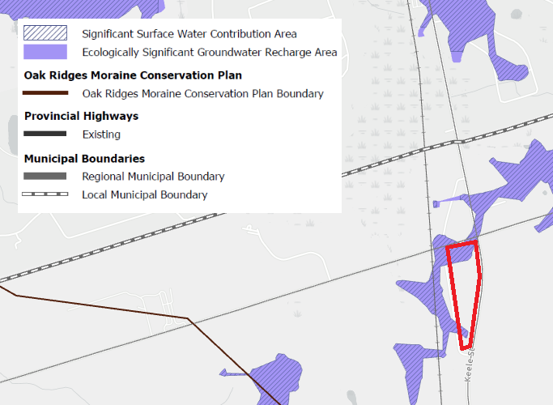
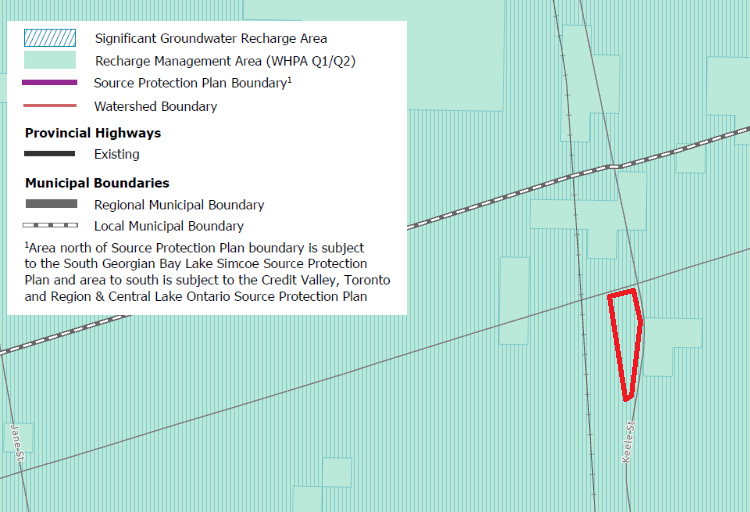

# Temporary Use Zoning By-Law coming before the City of Vaughan.

**Location:** on Oak Ridges Moraine, 141 Maloy St (Keele & King Vaughan Rd)

**Concerns:** Site is on the ORM (Natural Linkage and abuts Natural Core) and requested temporary parking lot for storage of vehicles. [EXTRACT FROM COUNCIL MEETING MINUTES OF SEPTEMBER 28, 2022](https://pub-vaughan.escribemeetings.com/filestream.ashx?DocumentId=120756):

> - The proposed temporary outside storage of 817 motor vehicles, including the temporary preparation and inspection of new motor vehicles as an accessory use is
not a permitted use within the Natural Linkage Area designation in VOP 2010.
>- The Planning Act, requires that all planning decisions conform to Provincial Policies, including the policies of the Oak Ridges Moraine Conservation Plan. The proposed temporary use for the Subject Lands is not permitted by the VOP 2010. However, Policy 10.1.2.4 of the VOP provides that Zoning By-laws may allow the temporary use of land, building or structures provided the temporary uses meet 4 conditions.

**Additional Notes:**

- [Tuesday, April 09, 2024 CofW Meeting](https://pub-vaughan.escribemeetings.com/Meeting.aspx?Id=50d16b50-c049-4084-8e58-2e4ac13b68b7&Agenda=Agenda&lang=English), Regional Councillor Jackson brought forward a motion (around the 26th minute mark on the video). **_There is no written record_**. Motion is seeking staff to bring forward a report about conformity/authority to approve a temporary use on the ORM. 
- This has potential to be a precedent setting decision, there are historical non-compliance issues all over this area some with open and ongoing legal action. If this temporary zoning by-law proceeds it will likely absolve ongoing charges/investigations not just for this site but many others. 
- [Map 12B](https://storymaps.arcgis.com/collections/8a1198ece3d941c9ae4d9a9cb4cb2f41?item=17) of York Region's OP would show the site as Significant Surface Water Contribution Area and Ecologically Significant Groundwater Recharge Area, part of the Humber River Watershed:

- [Map 12A](https://storymaps.arcgis.com/collections/8a1198ece3d941c9ae4d9a9cb4cb2f41?item=16) shows these as Significant Recharge Area & WHPA Q1/A2:

