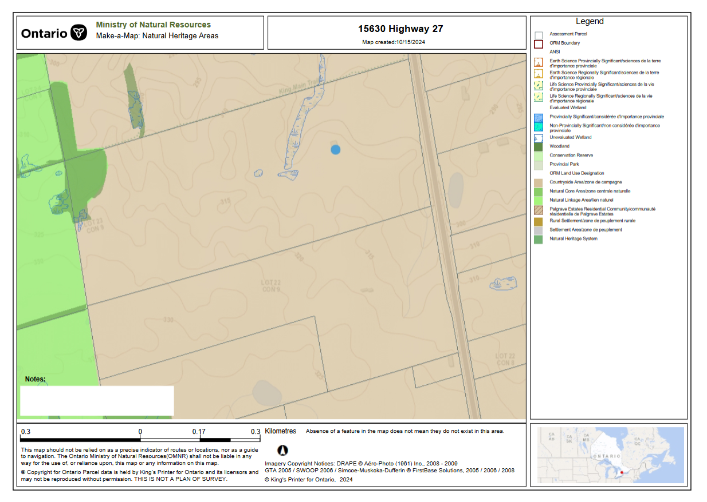

# 15630 HWY 27 Soil Dumping

**Location:** on Highway 27, north of 17 sideroad, west side.

**Concerns:** large soil dumping in close proximity to a large un-evaluated wetland. Major changes in grade will alter drainage patterns.

<!--  -->

 

According to <a href="https://storymaps.arcgis.com/collections/8a1198ece3d941c9ae4d9a9cb4cb2f41" target="_blank">York Region's 2022 Official Plan</a>, the area: 

1. is part of the agricultural system (Map 1a);
1. has a land use designation of agricultural (Map 1b);
1. is a recharge Management Area (Map 12A);
1. is a moderately complex landform under the ORM (Map 13).

As of 2024-11-21, King has an ongoing bylaw investigation (BLC2024-0721) as of 2024-10-30; can be found <a href="https://kingtownship.maps.arcgis.com/apps/webappviewer/index.html?id=e556741e151b4c95a0bf5c8d7a59cc19" target="_blank">here</a>.

King's bylaw has it zoned ORM Countryside.

More information on King's <a href="https://www.king.ca/sites/default/files/docs/2021-039%20%20-%20A%20By-law%20to%20Prohib__tion%20and%20Movement%20of%20Fill%20Consolidated%20CR%202024%2006%2020.pdf" target="_blank">By-law to prohibit and Regulate Site Alteration and Movement of Fill in the Township</a>.
