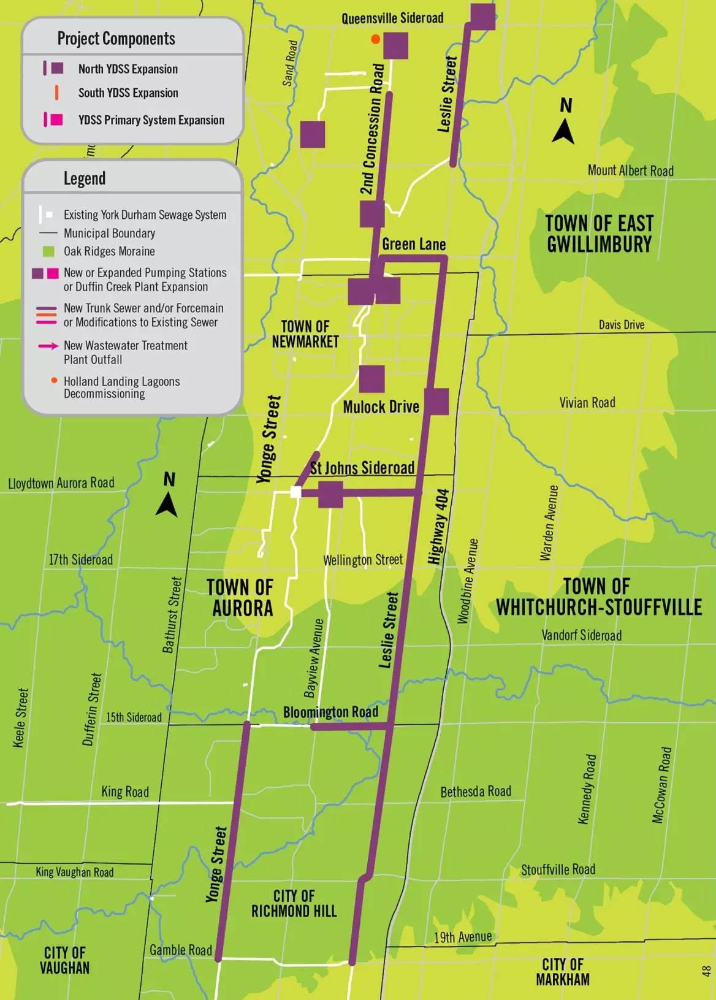

# York Region Sewage Works Project

> The Regional Municipalities of York and Durham are working together to carry out the York Region Sewage Works Project, a long-term wastewater infrastructure project across the Towns of East Gwillimbury, Newmarket, Aurora, Ajax and the Cities of Richmond Hill, Markham and Pickering.

excerpt from https://www.york.ca/newsroom/campaigns-projects/york-region-sewage-works-project

As required by the [Supporting Growth and Housing in York and Durham Regions Act, 2022](https://ero.ontario.ca/notice/019-6192#:~:text=To%20support%20More%20Homes%20Built,the%20needs%20of%20all%20Ontarians.).

**Location:** Multiple. See reports posted here: https://www.york.ca/newsroom/campaigns-projects/york-region-sewage-works-project

**Concerns** Leslie Street Trunk Sewer (excerpts from https://www.york.ca/media/116031):

- The depth of the Leslie Street Trunk Sewer sewer ranges from 10 to 70 metres below ground surface
- The...study area contains ecologically significant forests, wetlands, Provincially Significant Wetlands (PSWs) and Areas of Natural and Scientific Interest (ANSIs), including:
  - The White Rose-Preston Lake Wetland Complex (a PSW) contains the White Rose, Simeon Forest and Preston Lake Wetlands. 
  - The Wilcox-St. George Wetland Complex (a PSW) contains multiple wetlands within the study area.
  - The Rouge River Headwater Wetland Complex (a PSW) is in the southernmost portion of the study area. This wetland is protected under the ORMCP within TRCA jurisdiction and is under special consideration regarding the Rouge National Urban Park, which encompasses the Rouge River and its tributaries in the greater Toronto area.
  - The East Aurora Wetland Complex (a PSW)
  - The Bogart Creek Wetland Complex (a PSW)
- Several natural areas in the study area are potential candidates for Significant Wildlife Habitat (SWH).
- The Oak Ridges Moraine aquifer and the Thorncliffe aquifer Formation are the anticipated aquifers identified within the study area.
- High risk of spill contamination identified at Leslie and Wellington (Figure 6.14)

> "One key concern with trenchless construction relates to any sensitive infrastructure along or crossing the tunnel
alignment."