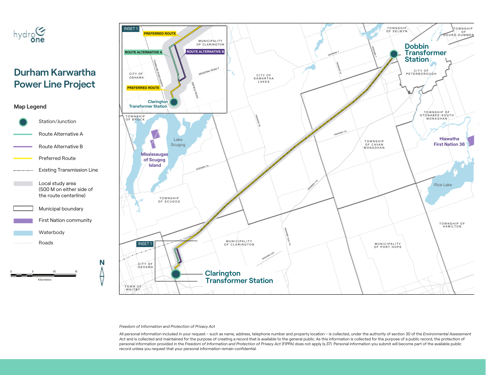

# The Durham Kawartha Power Line Project

**Location:** 50-kilometre double-circuit 230-kilovolt transmission line between Clarington and Peterborough

**More Information:** https://kawarthanow.com/2024/06/06/hydro-one-holding-community-consultations-on-new-transmission-line-to-run-between-clarington-and-peterborough/

 

`click image to expand`

