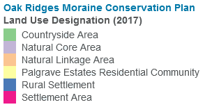
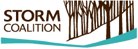
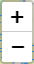
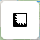
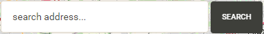
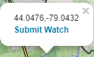

<!-- rsconnect::deployApp(account='stormcoalition',appName='mapstoryboard') -->

```{r setup, include=FALSE}
library(knitr)
library(flexdashboard)
library(sf)
library(geojsonio)
library(shiny)
library(leaflet)
library(leafem)
library(shiny)
library(shinyjs)
library(geojsonio)
library(dplyr)
library(tidygeocoder)


srcattr <- '<a href="https://stormcoalition.github.io" target="_blank" rel="noopener noreferrer"><b>STORM maps</b></a> | <a href="https://stormcoalition.github.io/sources.html" target="_blank" rel="noopener noreferrer"><b>Source Data</b></a> © <a href="https://www.stormcoalition.com/" target="_blank" rel="noopener noreferrer"><b>Save The Oak Ridges Moraine</b></a>'

orm <- st_read("https://raw.githubusercontent.com/stormcoalition/geojson/main/Oak_Ridges_Moraine_(ORM)_Land_Use_Designation-dissolve.geojson",quiet=TRUE)
grnblt <- st_read("https://raw.githubusercontent.com/stormcoalition/geojson/main/GREENBELT_DESIGNATION-wspecialtycrop-simplified-2023.geojson",quiet=TRUE)
bua <- st_read("https://raw.githubusercontent.com/stormcoalition/geojson/main/BUILT_UP_AREA-simplified.geojson",quiet=TRUE)
lspp <- st_read("https://raw.githubusercontent.com/stormcoalition/geojson/main/LSPP-simplified.geojson",quiet=TRUE)
gp <- st_read("https://raw.githubusercontent.com/stormcoalition/geojson/main/GGH-GrowthPlan.geojson",quiet=TRUE)

ormcp <- st_read("https://raw.githubusercontent.com/stormcoalition/geojson/main/Oak_Ridges_Moraine_(ORM)_Land_Use_Designation.geojson", quiet=TRUE)

ridings <- st_read("https://raw.githubusercontent.com/stormcoalition/geojson/main/ELECTORAL_DISTRICT_STORM.geojson", quiet=TRUE)
CAs <- st_read("https://raw.githubusercontent.com/stormcoalition/geojson/main/CONS_AUTH_ADMIN_AREA_STORM.geojson", quiet=TRUE)
munis <- geojson_read("https://raw.githubusercontent.com/stormcoalition/geojson/main/MUNIC_BND_ALL_STORM.geojson", what = "sp")
neword <- order(-munis@data$area)  # set order
munis@polygons <- munis@polygons[neword]
munis@plotOrder <- neword
munis@data <- munis@data %>% arrange(-area)

pits <- read_sf("https://raw.githubusercontent.com/stormcoalition/geojson/main/AGGSITE_AUTHORIZED_STORM.geojson", quiet=TRUE)
till <- read_sf("https://raw.githubusercontent.com/stormcoalition/geojson/main/SOLRIS-tilled-lands.geojson", quiet=TRUE)
peat <- read_sf("https://raw.githubusercontent.com/stormcoalition/geojson/main/SOLRIS-peat-topsoil-extraction.geojson", quiet=TRUE)
plnt <- read_sf("https://raw.githubusercontent.com/stormcoalition/geojson/main/SOLRIS-plantations-trees-cultivated.geojson", quiet=TRUE)
wwis <- read_sf("https://raw.githubusercontent.com/stormcoalition/geojson/main/WWIS_STORM.geojson", quiet=TRUE)

aoc <- st_read("https://raw.githubusercontent.com/stormcoalition/geojson/main/moraine-watch-aoc.geojson", quiet=TRUE)

basemaplegend <- "https://raw.githubusercontent.com/stormcoalition/shinyapps.io/main/images/basemap_legend.png"


Sys.setenv(LOCATIONIQ_API_KEY="pk.8fcc7051a94262fc4947ec73621e589f")
getLatLongFromAddress <- function(input.address, limits) {
  some_addresses <- tibble::tribble(
    ~name,                  ~addr,
    "me",                   input.address
  )
  lat_longs <- some_addresses %>% geocode(addr, method = 'iq', lat = latitude , long = longitude, limit=100, return_input=F)
  lat_longs = lat_longs[lat_longs$latitude>limits[1] & lat_longs$latitude<limits[2] & lat_longs$longitude>limits[3] & lat_longs$longitude<limits[4],]
  return(lat_longs)
}
```


### **The Oak Ridges Moraine** -- Greater Golden Horseshoe Policy Areas {data-commentary-width=420}

```{r orm, echo=FALSE, message=FALSE, warning=FALSE, out.width='100%'}
source("policy/srv/leaflet.R", local = TRUE)$value
```

***

The **Oak Ridges Moraine** (ORM) is a glacial formation created some 13,000 years ago. It is one of Ontario’s largest moraines, spanning 160 kilometres from the Niagara Escarpment to the Trent River system. The moraine acts like a giant sponge absorbing most of the rainwater and snowmelt, recharging and slowly releasing water to support the many river systems that flow north to Lakes Simcoe, Scugog and Rice and south to Lake Ontario. At 190,000 hectares, it is called the “rain barrel of southern Ontario” and makes up a large part of the Greenbelt Plan Area. STORM has created a number of interactive maps to de-mystify and help explain land use planning on the Oak Ridges Moraine and Greenbelt and for community members to discover their natural surroundings, identify elected/public representation and report to STORM at any given location within the ORM landscape. This and the following maps are themed accordingly, to serve your needs.

STORM has created a number of interactive maps for the community to access planning policy, discover their natural surroundings, identify elected/public representation and report to STORM at any given location within the ORM landscape. This and the following maps are themed accordingly, to serve your needs.

------------------------

To begin, the map on the left shows the Provincial policy boundaries in the Greater Golden Horseshoe.


[**Tips:**]{style="color:darkgreen"}

- Scroll around to see how the relationships between the different provincial plans and then click within any boundary to link to the different planning documents


### **Oak Ridges Moraine Conservation Plan:** Land Use Designations {data-commentary-width=500}

```{r ormcp, echo=FALSE, message=FALSE, warning=FALSE, out.width='100%'}
source("ORMCA/srv/leaflet.R", local = TRUE)$value
```

***

> STORM's years of experience and a well-developed network of local and regional contacts were critical to the campaign that saved (legislatively) the Oak Ridges Moraine (ORM). 

In 2001, the Ontario Legislature unanimously enacted the Oak Ridges Moraine Conservation Act and in 2002 the province passed the Oak Ridges Moraine Conservation Plan (ORMCP). [**Click here to read the ORMCP (2017)**](https://files.ontario.ca/oak-ridges-moraine-conservation-plan-2017.pdf).

The Plan divides the Moraine into four land use designations:

-   **Natural Core Areas** (38% of the Moraine)

-   **Natural Linkage Areas** (24% of the Moraine)

-   **Countryside Areas** (30% of the Moraine)

-   **Settlement Areas** (8% of the Moraine)

The ORMCP focuses on protecting headwater areas, watersheds and groundwater features and functions, as well as forests, wetlands and farmland, and is the jumping-off point for "smart growth" across Ontario.

Learn more about why conservation matters on the Moraine in [Episode 9](https://www.youtube.com/watch?v=ueool1sVE_I) of STORM's video series.

---------------------------------

You can use the map to explore the land use designations on the moraine.

[**Tips:**]{style="color:darkgreen"}

- click within any boundary to gain insight into each land use designation
- hide land use designation layer using the check box at the bottom-right





### **Save The Oak Ridges Moraine** -- who is STORM?

```{r storm, echo=FALSE, message=FALSE, warning=FALSE}
leaflet() %>%
  addTiles(attribution = srcattr) %>%
  addTiles("https://tile.oakridgeswater.ca/ORMbasemap/{z}/{x}/{y}", options = providerTileOptions(attribution=" © Save The Oak Ridges Moraine")) %>%
  
  # setView(lng = -78.95, lat = 44.1, zoom = 10)
  setView(lng = -79.0, lat = 44.0, zoom = 11) %>%
  addLogo(basemaplegend, src= "remote",  position = "bottomright", offset.x=10, offset.y=13,width=231, height=540)
```

***



**S**ave **T**he **O**ak **R**idges **M**oraine (STORM) Coalition works collaboratively and has established relationships of mutual support with diverse groups and organizations. STORM participates in environmental land use planning, policy development and stewardship to safeguard the moraine from inappropriate development.

Moraine Watch is a tool developed by STORM as a way for people to become "eyes on the Moraine and adjacent Greenbelt lands" by sharing information about  an activity that is of concern, or a whiteboard announcing a development application or a particularly interesting viewscape.

-------------------

[**Tips:**]{style="color:darkgreen"}

- Zoom in and out to explore the full character of the ORM and how the landscape intersects with community. As you zoom in, more detail is revealed!

<!-- {width=65%} -->


### **Mapping Tools and Functionality** {data-commentary-width=420}

```{r tools, echo=FALSE, message=FALSE, warning=FALSE}
leafletOutput("mapTools", height = "100vh")
absolutePanel(id = 'addrpanl',
  bottom = 10, left = 10,
  div(style="display:inline-block",textInput("taddr", NULL, value = "search address...")),
  div(style="display:inline-block",actionButton('baddr', 'Search')) 
)

output$mapTools <- renderLeaflet({
  leaflet() %>%
    addTiles(attribution = srcattr) %>%
    addTiles("https://tile.oakridgeswater.ca/ORMbasemap/{z}/{x}/{y}", options = providerTileOptions(attribution=" © Save The Oak Ridges Moraine")) %>%
    
    addMeasure(
      position = "topleft",
      primaryLengthUnit = "meters",
      primaryAreaUnit = "hectares",
      secondaryAreaUnit = "acres",
      activeColor = "#3D535D",
      completedColor = "#7D4479"
    ) %>%
  
    addEasyButton(easyButton(
      icon="fa-crosshairs", title="Locate Me",
      onClick=JS("function(btn, mapTools){ mapTools.locate({setView: true}); }"))
    ) %>%
    
    # setView(lng = -78.95, lat = 44.1, zoom = 10)
    setView(lng = -79.0, lat = 44.0, zoom = 11)
})

# mwpopup <- function(lat,lng) {
#   paste0('<br><a href="mailto:test@example.com?subject=MORAINE WATCH [',lat,',',lng,']',
#          '&body=What is the issue that you are concerned about?%0D%0A%0D%0A%0D%0A%0D%0A',
#          'Where? (so we know where the issue is):%0D%0A',
#          '  Region, Municipality, Town:%0D%0A',
#          '  Road Address/Major Intersection (if known):%0D%0A%0D%0A',
#          'Who is involved in this issue?:%0D%0A%0D%0A%0D%0A%0D%0A',
#          'Why are you concerned?:%0D%0A%0D%0A%0D%0A%0D%0A',
#          'When? (so we have an idea of how long has the issue been going on):%0D%0A%0D%0A%0D%0A%0D%0A',
#          'Additional Comments/Details (please attach photos if possible):%0D%0A%0D%0A"',
#          '><b>Submit Watch</b></a>')
# }
# 
# observeEvent(input$mapTools_click, {
#   event <- input$mapTools_click
#   lat <- round(event$lat, 4)
#   lng <- round(event$lng, 4)
#   leafletProxy("mapTools") %>%
#     addPopups(event$lng,event$lat,paste0(lat, ',', lng, mwpopup(lat, lng)))
# })

observeEvent(input$baddr, {
  isolate(
    if( input$taddr != "search address..."){
      lat_longs <- getLatLongFromAddress(input$taddr, c(43.5,44.3,-80.2,-77.9))
      print(paste0("result: ",lat_longs$latitude, " ", lat_longs$longitude))

      if(nrow(lat_longs)>0){
        leafletProxy("mapTools") %>%
          clearMarkers() %>% 
          addMarkers(lng = lat_longs$longitude, lat = lat_longs$latitude) %>%
          setView(lat_longs$longitude, lat_longs$latitude, zoom = 16)     
      } else {
        showNotification("Address not found. Please re-enter address (may need to be more specific).",type="warning")
      }
    }
  )
})
```

***

**Mapping Tools and Functionality**

With all of our maps, we provide a variety of tools to help users navigate the ORM.

----------------------------------------------

[**Map Zooming**]{style="color:DarkSlateBlue"}  

Using either your mouse scroll-wheel or the +/- buttons, zoom in/out of the map area. Note that greater detail can be reveled at different zoom levels

[**Map Measuring**]{style="color:DarkSlateBlue"}  

Using this button, one can measure both distances and areas on the map.

[**Locate Button**]{style="color:DarkSlateBlue"}  

Use this button to centre the map on your location. *(Will need to allow your browser to grant location information.)*

[**Data Sources**]{style="color:DarkSlateBlue"} 

 

In the bottom right corner of all maps, there exists a set of links that provide reference to the information used in the maps.

[**Search Address**]{style="color:DarkSlateBlue"}

 

Use this to enter an address to be located on the map. It is important that the addresses inputted are specific, here are some examples:

- `Red Oak Trail, Uxbridge, ON L9P 1R4`
- `38 Coates Rd E, Oshawa`


### **Jurisdictions** within the Oak Ridges Moraine

```{r jurisd, echo=FALSE, message=FALSE, warning=FALSE, out.width='100%'}
source("jurisdiction/srv/leaflet.R", local = TRUE)$value
```

***

The Jurisdictional map is used to help users identify which office, i.e., municipality, provincial riding and Member of Provincial Parliament (MPP) and/or conservation authority, should be contacted about a particular concern.

-------------------------------

[**Tips:**]{style="color:darkgreen"}

- click within any riding to reveal the contact info for the local Member of Provincial Parliament (MPP)
- click within any municipality or conservation authority to link to their website and contact info
- switch layers using the radio button in the top right corner


### **Natural Resources**

```{r resourc, echo=FALSE, message=FALSE, warning=FALSE, out.width='100%'}
pitsPal <- colorFactor(
  c('#e67e8c','#f0027f','#beaed4','grey40'),
  domain = pits$STATUS
)
source("resource/srv/leaflet.R", local = TRUE)$value
```

***

The Natural Resources map is used to identify resource extraction and agricultural practices occurring on the Oak Ridges Moraine. Practices include:

1. Aggregate operations (both active and inactive)
1. Agricultural fields managed as continuous annual row crops
1. Peat/Topsoil extraction
1. Plantations/Tree Cultivation
1. Well records

-------------------------------

[**Tips:**]{style="color:darkgreen"}

- show/hide layers using the check boxes in the bottom right corner
- hover and click layer objects to reveal more details
- MECP paper well records can be accessed by clicking a well location


### **STORM Moraine Watch** {data-commentary-width=600}

```{r morainewatch, echo=FALSE, message=FALSE, out.width='100%'}
# leafletOutput("mapMW", height = "100vh")
# source("MoraineWatch/srv/leaflet.R", local = TRUE)$value

leafletOutput("mapMW", height = "100vh")

output$mapMW <- renderLeaflet({
  leaflet() %>%
    addTiles(attribution = srcattr) %>%
    addTiles("https://tile.oakridgeswater.ca/ORMbasemap/{z}/{x}/{y}", options = providerTileOptions(attribution=" © Save The Oak Ridges Moraine")) %>%
    
    addMeasure(
      position = "topleft",
      primaryLengthUnit = "meters",
      primaryAreaUnit = "hectares",
      secondaryAreaUnit = "acres",
      activeColor = "#3D535D",
      completedColor = "#7D4479"
    ) %>%
  
    addEasyButton(easyButton(
      icon="fa-crosshairs", title="Locate Me",
      onClick=JS("function(btn, mapMW){ mapMW.locate({setView: true}); }"))
    ) %>%
    
    addPolygons(
      data = ormcp,
      color = "black",
      weight = 2,
      fillColor = ~ormcpPal(LAND_USE_DESIGNATION),
      opacity = .5,
      group="Show ORMCP Land use Designation",
      label = ~LAND_USE_DESIGNATION,
      popup = ~paste0(
        '<b>Land Use Designation: ', LAND_USE_DESIGNATION,"</b>",
        '<br>', LAND_USE_DESIG_DEFINITION
      ),
      highlightOptions = highlightOptions(
        opacity = 1, fillOpacity =.8, weight = 5, sendToBack = FALSE
      )
    ) %>%
    
    addPolygons(
      data = aoc,
      layerId = ~id,
      color = "red",
      weight = 3,
      # fillColor = ~ormcpPal(LAND_USE_DESIGNATION),
      opacity = .5,
      # group="ORM Land use",
      label = ~name,
      highlightOptions = highlightOptions(
        opacity = 1, fillOpacity = 1, weight = 5, sendToBack = FALSE
      )
    ) %>%
    
    addLayersControl(
      # baseGroups = c("OSM", "basemap"),
      overlayGroups = "Show ORMCP Land use Designation",
      position = 'bottomright',
      options = layersControlOptions(collapsed = FALSE)
    ) %>% hideGroup("Show ORMCP Land use Designation") %>%
    
    setView(lng = -79.0, lat = 44.1, zoom = 10) %>%
    addLogo("https://raw.githubusercontent.com/stormcoalition/shinyapps.io/main/images/logo-transp.png", src= "remote", width = 127)
})

mwpopup <- function(lat,lng) {
  paste0('<br><a href="https://docs.google.com/forms/d/e/1FAIpQLSc2vdJSsAJuwqtx1KXNak-dR_0nQVwza96SW4laxJM8qqyNwA/viewform?usp=pp_url&entry.597103671=[',lat,',+',lng,']"',
         '><b>Submit Watch--online form</b></a>',
         '<br><a href="mailto:contact@stormcoalition.com?subject=MORAINE WATCH [',lat,',',lng,']',
         '&body=What is the issue that you are concerned about?%0D%0A%0D%0A%0D%0A%0D%0A',
         'Where? (so we know where the issue is):%0D%0A',
         '  Region, Municipality, Town:%0D%0A',
         '  Road Address/Major Intersection (if known):%0D%0A%0D%0A',
         'Who is involved in this issue?:%0D%0A%0D%0A%0D%0A%0D%0A',
         'Why are you concerned?:%0D%0A%0D%0A%0D%0A%0D%0A',
         'When? (so we have an idea of how long has the issue been going on):%0D%0A%0D%0A%0D%0A%0D%0A',
         'Additional Comments/Details (please attach photos if possible):%0D%0A%0D%0A"',
         '>(alternatively, submit by email)</a>')
}

observeEvent(input$mapMW_click, {
  event <- input$mapMW_click
  lat <- round(event$lat, 4)
  lng <- round(event$lng, 4)  
  leafletProxy("mapMW") %>% 
    addPopups(event$lng,event$lat,paste0(lat, ',', lng, mwpopup(lat, lng)))
})

clk <- reactiveValues(clickedShape=NULL)

observeEvent(input$mapMW_shape_click, { clk$clickedShape <- input$mapMW_shape_click })

observeEvent(input$mapMW_click, {
  leafletProxy("mapMW") %>% clearPopups()
  event <- input$mapMW_click
  if (is.null(event)) return()
  lat <- round(event$lat, 4)
  lng <- round(event$lng, 4)

  if (!is.null(clk$clickedShape)) {
    click <- clk$clickedShape
    idx <- which(aoc$id == click$id)
    z <- aoc$zoom[[idx]]
    
    leafletProxy("mapMW") %>%
      setView(lng = click$lng, lat = click$lat, zoom = 14) %>%
      addPopups(event$lng,event$lat,paste0('<b>',aoc$name[[idx]],'</b>', 
                                           "<br>Source: ", aoc$source[[idx]], '<a href="', aoc$link[[idx]], '" target="_blank" rel="noopener noreferrer"><i> read more...</i></a>',
                                           "<br>Date submitted: ", aoc$date_recorded[[idx]]))
  } else {
    leafletProxy("mapMW") %>% 
      addPopups(event$lng,event$lat,paste0('Coordinates: ', lat, ',', lng, mwpopup(lat, lng)))
  }
  clk$clickedShape <- NULL
})

```

***

> Using geographic information systems (GIS) mapping tools, STORM harnesses the power of community groups and concerned citizens.

<!-- The Moraine Watch mapping tool provides an interactive resource to view and report areas of development that are monitored by STORM's Moraine Watch Program. -->

This mapping tool is designed to assist the Moraine Watch Program, providing an interactive resource to citizens concerned with land use changes on the Oak Ridges Moraine. Concerns about development can be reported directly by clicking on an area of concern on the map and selecting the "Submit Watch" link. Users are redirected to an email where they can detail their concerns about development on the Moraine. If citizens would like to search for a specific location they can use the search bar by typing in the address of interest.

On this map you can see:

-   [Red polygons]{style="color:red"} show the boundaries of current locations of development concern on the ORM that have been reported by volunteers like you.

-   You can see the name of each area of concern by hovering your cursor over the [red polygons]{style="color:red"}.

-   Click on one of the [red polygons]{style="color:red"} to view more information (source, date, other links).

<!-- Click to the next page to see an example of a watch that has been submitted to the moraine watch. -->

------------------------------------------------------------------------

Are you concerned with land use changes occurring atop the ORM? You can report your concerns here using the Moraine Watch Map. Concerns about development can be reported directly by submitting a watch. Concerns will be reviewed by STORM and shown on the map if found to be an area of concern to the ORM. To do this:

1.  Using the map on this page, locate the area where you would like to report a development problem.

2.  Clicking on the approximate area of concern on the map.

3.  A popup will appear with the words ["Submit Watch"]{style="color:blue"}.

4.  Click ["Submit Watch"]{style="color:blue"} to send an email detailing your concerns about development on the Oak Ridges Moraine.

<center>

</center>

You can also submit a development concern by visiting the [**Moraine Watch Map**](https://stormcoalition.shinyapps.io/morainewatch/) on our website.


<!-- ### Mary Lake Example -->

<!-- ```{r marylake, echo=FALSE, message=FALSE} -->
<!-- leaflet() %>% -->
<!--   addTiles(attribution = '<a href="https://stormcoalition.github.io" target="_blank" rel="noopener noreferrer"><b>STORM maps</b></a> | <a href="https://stormcoalition.github.io/sources.html" target="_blank" rel="noopener noreferrer"><b>Source Data</b></a> © <a href="https://www.stormcoalition.com/" target="_blank" rel="noopener noreferrer"><b>Save The Oak Ridges Moraine</b></a>') %>% -->
<!--     addTiles("https://tile.oakridgeswater.ca/ORMbasemap/{z}/{x}/{y}", options = providerTileOptions(attribution=" © Save The Oak Ridges Moraine")) %>% -->

<!--      setView(lng = -79.546596, lat = 43.951868, zoom = 14) %>% -->

<!--     addPolygons( -->
<!--       data = aoc, -->
<!--       layerId = ~id, -->
<!--       color = "red", -->
<!--       weight = 3, -->
<!--       # fillColor = ~ormcpPal(LAND_USE_DESIGNATION), -->
<!--       opacity = .5,  -->
<!--       # group="ORM Land use", -->
<!--       label = ~name, -->
<!--       highlightOptions = highlightOptions( -->
<!--         opacity = 1, fillOpacity = 1, weight = 5, sendToBack = FALSE -->
<!--       ) -->
<!-- ) -->

<!-- ``` -->

<!-- *** -->

<!-- Let's look at Mary Lake as an example. Click on the Mary Lake area polygon to learn more about the development concern in this area. Have the map on the story focused on this area so it is easy for users to find and click on. -->

<!-- Volunteers can submit their concerns using this map. Concerns will be reviewed by STORM and shown on the map if found to be an area of developmental concern on the ORM. -->


### **Next Steps**

```{r nextsteps, echo=FALSE, message=FALSE, warning=FALSE}
leaflet() %>%
  addTiles(attribution = srcattr) %>%
  addTiles("https://tile.oakridgeswater.ca/ORMbasemap/{z}/{x}/{y}", options = providerTileOptions(attribution=" © Save The Oak Ridges Moraine")) %>%
  
  # setView(lng = -78.95, lat = 44.1, zoom = 10)
  setView(lng = -79.0, lat = 44.0, zoom = 11) #%>%
  # addLogo(basemaplegend, src= "remote",  position = "bottomright", offset.x=10, offset.y=13,width=231, height=540)
```


***

> We can all be stewards of the Oak Ridges Moraine!

Here are some things you can do to be a an active participant in stewardship of the Moraine:

1.  Share this information with people you know that live on, or visit the Oak Ridges Moraine regularly. Protecting and preserving the ORM will be more successful if we work together as a community.

2.  Educating yourself can help you know where to turn for information. Do you know what jurisdiction you are in? Which Conservation Authority manages your watershed? The name of the Member of Provincial Parliament (MMP) in your area? You can use the map on this page to find this information.

3.  If you would like to do more, volunteer with us! Fill out our volunteer form [**here**](https://forms.gle/Ea28c8GF1urGaB1V6).

Thank you for your support!

------------------------------------------------------------------------

This Storyboard was created using a [storyboard template](https://testing-apps.shinyapps.io/flexdashboard-storyboard/) from [Flexdashboard](https://pkgs.rstudio.com/flexdashboard?_gl=1*1g425u*_ga*MTE0MjQzNzQ5NS4xNzAxMjA1NzM0*_ga_2C0WZ1JHG0*MTcxMTQ2Njc5NS4zLjEuMTcxMTQ2NzY4NC4wLjAuMA../).
